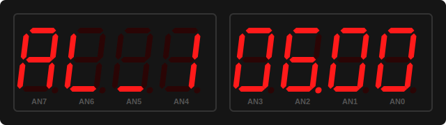

# DE1-Alarm Clock

1. Lukáš Katrňák (zodpovědný za obsluhu sedmisegmentového displeje)
2. Vojtěch Kudela (zodpovědný za řízení hodin a finální kompletaci)
3. Jan Jaroslav Koláček (zodpovědný za obsluhu alarmu a poster)

## Teoretický popis

Tento projekt se zaměřuje na realizaci plně funkčního digitálního budíku v jazyce VHDL, určeného pro implementaci do hradlových polí (FPGA). Cílem bylo vytvořit systém, který nejen přesně měří čas, ale také poskytuje pokročilé uživatelské rozhraní pro správu více budíků s funkcí odloženého buzení (Snooze). Návrh je postaven na principech synchronní číslicové techniky, modularity a efektivního využití hardwarových zdrojů.

### Blokové schéma Alarm Clock

### Časová základna a hierarchické dělení kmitočtu
Základem každého digitálního chronometru je stabilní oscilátor. Vzhledem k tomu, že vnitřní hodiny FPGA pracují na vysoké frekvenci (typicky 100 MHz), tvoří první logickou vrstvu kódu generátor povolovacích pulzů (Clock Enable). Místo vytváření nových hodinových domén, které by mohly vést k problémům s časováním, systém využívá čítač, který každou sekundu vygeneruje jeden krátký pulz. Tento pulz slouží jako impuls pro hlavní čítač času, který v kaskádovém uspořádání inkrementuje vteřiny, minuty a hodiny v šestnáctkové či desítkové soustavě s příslušnými moduly (60 pro vteřiny a minuty, 24 pro hodiny).

### Ošetření vstupů a uživatelská interakce
Klíčovou výzvou při návrhu vestavěných systémů je interakce s reálným světem. Mechanická tlačítka trpí jevem zvaným kmity kontaktů (bouncing). V kódu je tento problém vyřešen modulem pro digitální filtraci, který vzorkuje stav tlačítka v delších intervalech a vyhodnotí stisk až po ustálení signálu. Navazující logika detekce hran zajišťuje, že každý stisk vyvolá právě jednu akci. Pro pokročilé ovládání, jako je vstup do editačního režimu, je implementován algoritmus pro měření délky stisku – tzv. Long Press logika, která vyžaduje podržení tlačítka po dobu 2 sekund.

### Dynamické řízení zobrazení a stavová logika
Pro zobrazení času je využit sedmisegmentový displej s technologií dynamického multiplexování. Aby se ušetřily vývody FPGA, jsou segmenty všech číslic propojeny a systém v rychlém sledu (řády stovek Hz) přepíná mezi jednotlivými pozicemi (anodami). Lidské oko díky setrvačnosti vnímá obraz jako statický. Celé chování systému – od běžného zobrazení času přes prohlížení tří nezávislých budíků až po jejich nastavování – je řízeno konečným stavovým automatem (FSM). Ten zaručuje, že se zařízení nachází vždy v definovaném stavu a správně reaguje na uživatelské podněty.

### Logika budíku a správa paměti
Systém obsahuje vnitřní paměťové registry pro uložení tří časů buzení. Komparační jednotka v každém hodinovém cyklu porovnává aktuální čas s časy v paměti. Pokud dojde ke shodě a daný budík je aktivován uživatelským přepínačem, dojde k aktivaci zvukového výstupu. Implementovaná funkce Snooze využívá pomocný čítač, který po stisku tlumicího tlačítka pozastaví alarm na přesně definovaný interval (5 minut), po jehož uplynutí se proces porovnávání a buzení automaticky restartuje.

## Hardwarový popis a demo aplikace
Zařízení bylo oživeno a testováno na desce **NEXY-A7-50T**. Tato deska obsahuje mimo jiné **osmimístný sedmisegmentový display**, **3 LED diody** a **5 tlačítek**, což jsou periferie, které byly užity. Další zařízení bylo připojeno na vnější port **buzzer**, tedy *(JA[1])*. Na ten byl připojen _**buzzer**_, který slouží k zvukové signalizaci, při spuštění alarmu.

## Popis jednotlivých periferií

| Signal Name | Direction | Width | Description |
| :--- | :---: | :---: | :--- |
| **clk** | Input | 1 | Systémový hodinový signál 100 MHz |
| **rst** | Input | 1 | Reset celých hodin provádějí se pomocí vypínače rst _**(sw15)**_ |
| **btnU** | Input | 1 | Tlačítko nahoru (nastavení/zvyšování času hodin a alarmů) |
| **btnD** | Input | 1 | Tlačítko dolů (nastavení/snižování času hodin a alarmů) |
| **btnL** | Input | 1 | Tlačítko doleva (přechod mezi módy - hodiny/alarm) |
| **btnR** | Input | 1 | Tlačítko doprava (přechod mezi nastavováním HH a MM) |
| **btnC** | Input | 1 | Tlačítko střední (nastavování / potvrzování - podržení min. 2s) |
| **sw0** | Input | 1 | Vypínač pro zapnutí/vypnutí budíku 1 |
| **sw1** | Input | 1 | Vypínač pro zapnutí/vypnutí budíku 2 |
| **sw2** | Input | 1 | Vypínač pro zapnutí/vypnutí budíku 3 |
| **an[7:0]** | Output | 8 | Řízení aktivní anody 8místného sedmisegmentového displeje |
| **seg[6:0]** | Output | 7 | Řízení jednotlivých segmentů (katod A-G) displeje |
| **dp** | Output | 1 | Desetinná tečka displeje (indikace plynoucích sekund) |
| **led[2:0]** | Output | 3 | Indikace stavu budíků on/off |
| **buzzer** | Output | 1 | Výstup pro zvukový generátor signálu (bzučák) |

### Top level

Blok [`top_alarm_clock`](https://github.com/VojtaKudela/DE1-Alarm-Clock/blob/main/MAIN/top_alarm_clock.vhd) je nejvyšší úrovní celého zařízení. Zde jsou utvořeny vývody pro jednotlivé periferie, které jsou poté přiřazeny pomocí contrainu. Vývody btnC, btnD, btnU, btnR a btnL jsou připojeny k jednotlivým tlačítkům na desce. Vývod LED[15:0] je připojen k LED diodám na desce. Vývody CA, CB, CC, CD, CE, CF, CG, DP, AN[7:0] řídí sedmisegmentový display. Vývod CLK100MHZ potom je připojen na zdroj hodinových pulzů.

## Sofwarový popis
Celé zařízení je možno si rozdělit na několika částí. Každý z nich obsahuje odlišnou část zařízení. 

### Nastavování hodin a budíku

Blok `time_core` představuje hlavní _**"mozek"**_ celého budíku. Je zodpovědný za udržování přesného času a řízení logiky uživatelského rozhraní. Modul je vnitřně rozdělen na dvě hlavní části, a to `time_counter` a `main_loop`. 

**1. Čítač času ([`time_counter`](https://github.com/VojtaKudela/DE1-Alarm-Clock/blob/main/MAIN/time_counter.vhd))**

Jedná se o čítač, který zpracovává impulsy o frekvenci 1 Hz (sekundové tiky). Jeho princip spočívá v tom, že čítač inkrementuje vteřiny do 59, následně přičte minutu a po dosažení 59 minut inkrementuje hodiny (v režimu 00–23). Modul umožňuje přímý zápis (nastavení) hodin a minut pomocí signálů `set_h` a `set_m`. Při nastavování se vteřiny automaticky vynulují, aby byl zajištěn přesný start měření.

**2. Stavový automat hodin ([`main_loop`](https://github.com/VojtaKudela/DE1-Alarm-Clock/blob/main/MAIN/main_loop.vhd))**

Tato část implementuje logiku přepínání mezi jednotlivými režimy zobrazení a nastavení. Je tvořen dvěmi nezávislými stavovými automaty, které běží paralelně:

1. _**Automat zobrazení**_ (`view_state`)**
   
Stavy systému: Automat přepíná mezi stavy pro zobrazení aktuálního času  `TIME_VIEW`  anáhleda mezi třemi různými budíky  `AL1_VIEW` až `AL3_VIEW`. Tento automat mění stavy pouze tehdy, když se nic nenastavuje, tedy když `set_state = S_OFF`. K přepínání se používají zechycené hrany tlačítek `mode_up_rise` a `mode_down_rise`.

**Tabulka přechodů a výstupů**

| Aktuální stav | mode_up_rise | mode_down_rise | Další stav |
|--------------|--------------|----------------|------------|
| TIME_VIEW    | 1            | 0              | AL1_VIEW   |
| TIME_VIEW    | 0            | 1              | AL3_VIEW   |
| AL1_VIEW     | 1            | 0              | AL2_VIEW   |
| AL1_VIEW     | 0            | 1              | TIME_VIEW  |
| AL2_VIEW     | 1            | 0              | AL3_VIEW   |
| AL2_VIEW     | 0            | 1              | AL1_VIEW   |
| AL3_VIEW     | 1            | 0              | TIME_VIEW  |
| AL3_VIEW     | 0            | 1              | AL2_VIEW   |

**Poznámka:** Po resetu (`rst = '1'`) přejde automat vždy do výchozího stavu `TIME_VIEW`.

2. _**Automat nastavování**_ (`set_state`)**

Tento automat čeká na dlouhá podržení prostředního tlačítka po dobu **2s** a následně umožňuje přepínat mezi nystavováním hodin a minut. Jde o kombinaci Mooreona a Mealyho stavového automatu, protože signály `set_hh` a `set_mm` reagují na okamžitý stisk tlačítek, i když už ve stavu jsme.

  
  

    <em><strong>Tab. 1:</strong> Blokové schéma stavového automatu pro žízení hodin </em>
  

### Display
O zobrazování dat na 8místném sedmisegmentovém displeji desky Nexys A7 se stará modul `driver_7seg_8digits`. Aby bylo dosaženo rozsvícení všech 8 cifer „najednou“, využívá se principu rychlého multiplexování. Cifry se střídají každé 2 milisekundy (obnovovací frekvence 500 Hz), což lidské oko díky setrvačnosti vnímá jako souvislý obraz. 

Displej je logicky rozdělen na tyto sekce:
* **Pravá část (AN0–AN3):** Slouží k zobrazení samotného času ve formátu `HH:MM`. Interní binární hodnoty jsou matematicky převáděny na desítky a jednotky (BCD formát), aby na displeji svítily správné číslice (0–9).
* **Levá část (AN4–AN7):** Funguje jako stavový indikátor menu. Při sledování běžného času je tato část zcela zhasnuta. Jakmile uživatel přepne na budíky, zobrazí se zde text `AL_1`, `AL_2` nebo `AL_3`.
* **Desetinná tečka (dvojtečka) (DP):** Při běžném chodu bliká s frekvencí 1 Hz (500 ms svítí, 500 ms nesvítí) a vizuálně tak oživuje chod hodin. Jakmile uživatel vstoupí do režimu nastavování času, tečka začne trvale svítit.
 

  <table>
    <tr>
      <td align="center"><b>Běžný režim (Zobrazení času)</b></td>
      <td align="center"><b>Režim nastavení (Editace budíku)</b></td>
    </tr>
    <tr>
      <td></td>
      <td></td>
    </tr>
  </table>

 
Řízení displeje je rozděleno do tří hlavních strukturálních bloků:

1. **[`clk_en`](https://github.com/VojtaKudela/DE1-Alarm-Clock/blob/main/MAIN/clk_en.vhd) (Generátor povolovacího pulzu):**
   Bere systémový hodinový signál (100 MHz) a funguje jako dělička frekvence. Každé 2 milisekundy (500 Hz) vygeneruje jeden krátký povolovací pulz (`en`), který dává pokyn k přepnutí na další cifru.

2. **[`cnt_up_down`](https://github.com/VojtaKudela/DE1-Alarm-Clock/blob/main/MAIN/cnt_up_down.vhd) (Čítač / Ukazatel adresy):**
   Tříbitový synchronní čítač, který přijímá pulzy z `clk_en`. Neustále odpočítává v rozsahu od 7 do 0. Jeho aktuální hodnota slouží jako adresa, která říká nadřazenému multiplexoru, která z 8 cifer má být v danou chvíli fyzicky aktivní (rozsvícená).

3. **[`bin2seg`](https://github.com/VojtaKudela/DE1-Alarm-Clock/blob/main/MAIN/bin2seg.vhd) (Převodník / Dekodér znaků):**
   Kombinační obvod, který funguje jako překladový slovník. Přijímá 5bitový datový signál a okamžitě ho převádí na 7bitový vektor pro jednotlivé segmenty (A-G) displeje. Obsahuje logiku pro číslice 0-9 a speciální znaky (A, L, _, H, o, d) potřebné pro navigaci v menu budíku.

  
  

    <em><strong>Tab. 1:</strong> Pravdivostní tabulka dekodéru pro číslice 0–9 a speciální znaky (A, L, _, H, o, d). Signály jsou aktivní v logické 0 (Common Anode).</em>
  

#### Architektura a princip multiplexování
Samotný `driver_7seg_8digits` všechny tyto moduly propojuje a obsahuje centrální **multiplexor**. Ten sleduje aktuální hodnotu z čítače a na jejím základě provede tři akce současně:
* Vybere správná 5bitová data ze vstupů (od nadřazeného hodinového modulu) a pošle je do dekodéru `bin2seg`.
* Nastaví logickou "0" na příslušný pin sběrnice `AN` (Anody), čímž zapne napájení pouze pro konkrétní cifru na desce (běžící nula).
* Vyhodnotí, zda má na dané pozici svítit desetinná tečka (`dp_o`), která v projektu slouží k indikaci plynoucích sekund (blikání 1 Hz) mezi hodinami a minutami.

#### Blokové schéma řízení displeje

  
  

    <em>Obr. 2: Interní blokové schéma modulu driver_7seg_8digits pro multiplexní řízení 8místného displeje.</em>
  

### Alarm
Systém budíku je plně hardwarový a nevyužívá žádný mikrokontrolér. Jeho řízení je rozděleno do tří nezávislých podmodulů, které se starají o uchování času, porovnání s reálnými hodinami a generování akustického signálu.

**1. Paměť budíku ([`alarm_memory.vhd`](https://github.com/VojtaKudela/DE1-Alarm-Clock/blob/main/MAIN/alarm_memory.vhd))**
Tento modul slouží jako nezávislé úložiště pro čas, na který je budík nastaven. 
* Čas se ukládá do vnitřních registrů a výchozí hodnota po resetu je `00:00`.
* Modul přijímá ošetřené signály z tlačítek (pulzy o délce jednoho taktu), pomocí kterých uživatel inkrementuje hodiny a minuty. Modul automaticky řeší přetečení (po 23. hodině následuje 0, po 59. minutě 0).

**2. Řídicí logika a FSM ([`alarm_control.vhd`](https://github.com/VojtaKudela/DE1-Alarm-Clock/blob/main/MAIN/alarm_control.vhd))**
Jde o hlavní mozek celého alarmu. Obsahuje komparátor a stavový automat (FSM), který neustále porovnává reálný čas z hlavních hodin s časem uloženým v paměti budíku.
* **Aktivace:** Budík zvoní pouze pokud jsou splněny dvě podmínky: přepínač na desce je v poloze ON a aktuální čas se přesně shoduje s nastaveným časem budíku (ve vteřině 00).
* **Zastavení (Típnutí):** Jakmile budík začne zvonit, FSM se uzamkne ve stavu zvonění. K jeho zastavení musí uživatel stisknout levé tlačítko (`btnl`). FSM si toto stisknutí zapamatuje a alarm umlčí až do dalšího dne.

**3. Generátor signálu pro bzučák (`buzzer_driver.vhd`)**
Piezo bzučák připojený na Pmod konektor potřebuje pro generování zvuku PWM signál, protože se nejedná o aktivní bzučák s vlastní oscilační frekvencí.
* Modul generuje základní **tón o frekvenci cca 2 kHz** (lidskému uchu nepříjemný zvuk).
* Aby budík nepískal jednolitě, je tento tón hardwarově modulován pomalejším signálem o frekvenci **2 Hz**. Výsledkem je přerušovaný, rytmický efekt "pípání-pípání-pípání", typický pro klasické digitální budíky.

## Instrukční návod

### Popis částí

### Popis ovládacích prvků

Po spuštění desky zařízení začne pracovat. Chod zařízení *řídí tlačítka na desce*. Umožňují **nastavovat čas**, **přepínat mezi jednotlivými módy** a přejít do **režimu nastavení času**.

### Natavení času

K možnosti nastavení času je potřeba po dobu 2 sekund stlačit tlačítko **NASTAVENÍ**. Primárně je nastaveno, že se nejdříve nastavuje čas hodin HH. K nastavení času slouží tlačítka **TIME +/-**. Čas HH je možné nastavovat v **rozmezí 0-23. Stejným způsobem se nastaveuje čas minut MM, přičemž rozsah je v **rozmezí 0-59**. K přechodu mezi nastavováním HH a MM slouží tlačítka **MODE HH / MM**. Při stisku se na displeji zobrazí aktuálně nastavený čas. Pro potvrzení nastaveného času stačí pouze stlačit tlačítko **NASTAVENÍ**. 

### Nastavení módu

Mód zařízení nastavíme stiskem **MODE PŘEDCHOZÍ / DALŠÍ. Zařízení pracuje ve čtyřeč módech: HODINY, ALARM 1 ALARM 2 a ALARM 3.

Nastavený mód bude zobrazen na displeji.

### Video ukázka

  <a href="https://www.youtube.com/watch?v=QMtP-8n-iPY">
    
    
<i>▶ Kliknutím spustíte video návod na YouTube </i>

  </a>

## Simulace a verifikace

V této sekci jsou zobrazeny průběhy simulací jednotlivých modulů, které ověřují správnost navržené logiky.

### 1. Paměť budíku (`alarm_memory`)
Simulace ověřuje ukládání času budíku a jeho inkrementaci pomocí pulsů `en_inc_hour` a `en_inc_min`.

### 2. Dekodér na 7-segmentový displej (`bin2seg`)
Ověření převodu 5bitové binární hodnoty na kód pro 7segmentový displej (společná anoda), včetně speciálních znaků jako 'A', 'L' nebo '_'.

### 3. Generátor pulzů (`clock_enable`)
Verifikace generování synchronizačních pulsů `ce` trvajících jeden hodinový takt v definovaných intervalech.

### 4. Ošetření zákmitů tlačítek (`debounce`)
Simulace demonstruje filtrování vstupního signálu z tlačítka a generování čistého pulsu `btn_press` na vzestupnou hranu stabilního stavu.

### 5. Ovladač 8místného displeje (`driver_7seg_8digits`)
Strukturální simulace multiplexního řízení 8 pozic displeje pomocí anodových signálů `dig_o` a segmentů `seg_o`.

### 6. Nastavení času (`time_setter`)
Ověření logiky pro manuální úpravu hodin a minut pomocí signálů `up_press`/`down_press` v závislosti na zvoleném módu `mode_sel`.

### 7. Hlavní čítač hodin a minut (`up_down_counter`)
Komplexní simulace obousměrného čítání času (HH:MM) s detekcí přetečení (23 -> 00, 59 -> 00) a ošetřením vstupních hran.

### 8. Návrh posteru

## REFERENCE
1. [Online VHDL Testbench Template Generator (lapinoo.net)](https://vhdl.lapinoo.net/testbench/).
2. [DATASHEET for Pasive Buzzer HW-508 V0.2](https://digizone.com.ve/wp-content/uploads/2022/03/KY-006-Joy-IT.pdf).
3. [Vytváření diagramů draw.io](https://www.drawio.com/).

### Pomoc s Githubem
4. [Jak upravovat README](https://docs.github.com/en/get-started/writing-on-github/getting-started-with-writing-and-formatting-on-github/basic-writing-and-formatting-syntax).
5. [Vytvoření složky](https://www.youtube.com/watch?v=FvCsnUgAdWA).
6. [Jak nahrát soubor](https://www.youtube.com/watch?v=ATVm6ACERu8).
