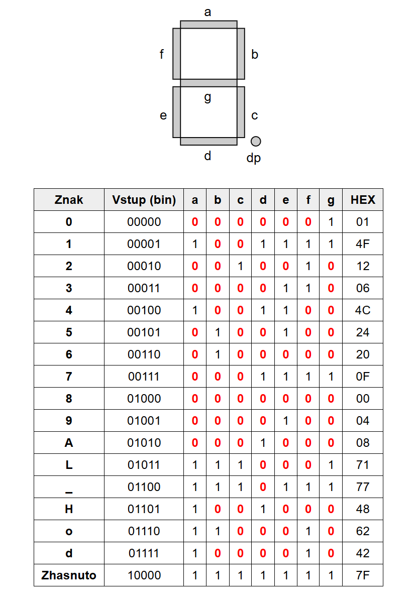
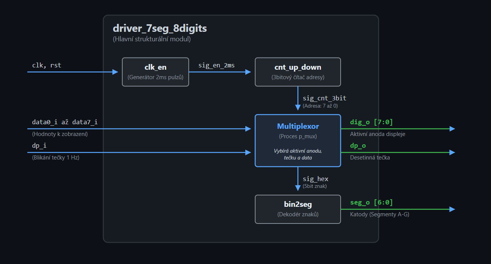

# DE1-Alarm Clock

1. Lukáš Katrňák (zodpovědný za obsluhu sedmisegmentového displeje)
2. Vojtěch Kudela (zodpovědný za řízení hodin)
3. Jan Jaroslav Koláček (zodpovědný za obsluhu alarmu)

### Blokové schéma Alarm Clock
.png)

## Inputs and Outputs

| Signal Name | Direction | Width | Description |
| :--- | :---: | :---: | :--- |
| **clk** | Input | 1 | Systémový hodinový signál 100 MHz |
| **btnu** | Input | 1 | Tlačítko nahoru (nastavení/zvyšování času hodin a alarmů) |
| **btnd** | Input | 1 | Tlačítko dolů (nastavení/snižování času hodin a alarmů) |
| **btnl** | Input | 1 | Tlačítko doleva (přechod mezi módy - hodiny/alarm) |
| **btnr** | Input | 1 | Tlačítko doprava (přechod mezi nastavováním HH a MM) |
| **btnc** | Input | 1 | Tlačítko střední (nastavování / potvrzování - podržení min. 2s) |
| **sw0** | Input | 1 | Vypínač pro zapnutí/vypnutí budíku 1 |
| **sw1** | Input | 1 | Vypínač pro zapnutí/vypnutí budíku 2 |
| **sw2** | Input | 1 | Vypínač pro zapnutí/vypnutí budíku 3 |
| **an[7:0]** | Output | 8 | Řízení aktivní anody 8místného sedmisegmentového displeje |
| **seg[6:0]** | Output | 7 | Řízení jednotlivých segmentů (katod A-G) displeje |
| **dp** | Output | 1 | Desetinná tečka displeje (indikace plynoucích sekund) |
| **led[16:0]** | Output | 17 | Indikace stavu budíků on/off a světelná signalizace zvonění |
| **buzz_out** | Output | 1 | Výstup pro zvukový generátor signálu (bzučák) |

### Popis jednotlivých periferií 
_**Vstupní perifirie**_
- CLK 100MHz -> vstupné hodinový tak, pro řízení hodin
- BTNU a BTND -> tlačítka pro nastavení šasu hodin  alarmů
- BTNL a BTNR -> přechod mezi módy a mezi HH a MM při nastavování času
- BTNC -> slouží k **nastavoání/potvrzování** (k nastavení dojde, pokud bude stlačeno po dobu minimálně 2 sekund)
- SW [0:2] -> vypínače slouží k zapnití a vypnutí budíku

_**Výstupní perifirie**_
- AN [7:0] -> slouží k řízení anod sedmisegmentového displeje
- SEG [6:0] -> řízení jednotlivých segmentů každého sedmisegmentového displeje
- BUZZER -> řízení alarmu (přiřadit periferii)
- LED_OUT [16:0] -> 3 LED nad switchy představují indikaci stavu budíku **on/off** (LED 0:2) a zbylé budou sloužit jako signalizace budíku (budou spuštěny ve stejný moment, kdy se spustí alarm)

## Hardwarový popis a demo aplikace
Zařízení bylo oživeno a testováno na desce **NEXY-A7-50T**. Tato deska obsahuje mimo jiné **osmimístný sedmisegmentový display**, **16 LED diod** a **5 tlačítek**, což jsou periferie, které byly užity. Další zařízení bylo připojeno na vnější porty **DOPLNIT**. Na ten byl připojen _**buzzer**_, který slouží k zvukové signalizaci, při spuštění alarmu.

### Náhled na zařízení

### Top level

## Sofwarový popis
Celé zařízení je možno si rozdělit na několika částí. Každý z nich obsahuje odlišnou část zařízení. 

### Display
O zobrazování dat na 8místném sedmisegmentovém displeji desky Nexys A7 se stará modul `driver_7seg_8digits`. Aby bylo dosaženo rozsvícení všech 8 cifer „najednou“, využívá se principu rychlého multiplexování. Cifry se střídají každé 2 milisekundy (obnovovací frekvence 500 Hz), což lidské oko díky setrvačnosti vnímá jako souvislý obraz. 

Displej je logicky rozdělen na tyto sekce:
* **Pravá část (AN0–AN3):** Slouží k zobrazení samotného času ve formátu `HH:MM`. Interní binární hodnoty jsou matematicky převáděny na desítky a jednotky (BCD formát), aby na displeji svítily správné číslice (0–9).
* **Levá část (AN4–AN7):** Funguje jako stavový indikátor menu. Při sledování běžného času je tato část zcela zhasnuta. Jakmile uživatel přepne na budíky, zobrazí se zde text `AL_1`, `AL_2` nebo `AL_3`.
* **Desetinná tečka (dvojtečka) (DP):** Při běžném chodu bliká s frekvencí 1 Hz (500 ms svítí, 500 ms nesvítí) a vizuálně tak oživuje chod hodin. Jakmile uživatel vstoupí do režimu nastavování času, dvojtečka začne trvale svítit.
 

Řízení displeje je rozděleno do tří hlavních strukturálních bloků:

1. **`clk_en` (Generátor povolovacího pulzu):**
   Bere systémový hodinový signál (100 MHz) a funguje jako dělička frekvence. Každé 2 milisekundy (500 Hz) vygeneruje jeden krátký povolovací pulz (`en`), který dává pokyn k přepnutí na další cifru.

2. **`cnt_up_down` (Čítač / Ukazatel adresy):**
   Tříbitový synchronní čítač, který přijímá pulzy z `clk_en`. Neustále odpočítává v rozsahu od 7 do 0. Jeho aktuální hodnota slouží jako adresa, která říká nadřazenému multiplexoru, která z 8 cifer má být v danou chvíli fyzicky aktivní (rozsvícená).

3. **`bin2seg` (Převodník / Dekodér znaků):**
   Kombinační obvod, který funguje jako překladový slovník. Přijímá 5bitový datový signál a okamžitě ho převádí na 7bitový vektor pro jednotlivé segmenty (A-G) displeje. Obsahuje logiku pro číslice 0-9 a speciální znaky (A, L, _, C, S, atd.) potřebné pro navigaci v menu budíku.

  
  

    <em><strong>Tab. 1:</strong> Pravdivostní tabulka dekodéru pro číslice 0–9 a speciální znaky (A, L, _, H, o, d). Signály jsou aktivní v logické 0 (Common Anode).</em>
  

#### Architektura a princip multiplexování
Samotný `driver_7seg_8digits` všechny tyto moduly propojuje a obsahuje centrální **multiplexor**. Ten sleduje aktuální hodnotu z čítače a na jejím základě provede tři akce současně:
* Vybere správná 5bitová data ze vstupů (od nadřazeného hodinového modulu) a pošle je do dekodéru `bin2seg`.
* Nastaví logickou "0" na příslušný pin sběrnice `AN` (Anody), čímž zapne napájení pouze pro konkrétní cifru na desce (běžící nula).
* Vyhodnotí, zda má na dané pozici svítit desetinná tečka (`dp_o`), která v projektu slouží k indikaci plynoucích sekund (blikání 1 Hz) mezi hodinami a minutami.

#### Blokové schéma řízení displeje

  
  

    <em>Obr. 2: Interní blokové schéma modulu driver_7seg_8digits pro multiplexní řízení 8místného displeje.</em>
  

### Nastavovíní hodin a budíku

### Alarm

## Instrukční návod

### Popis částí

### Nastavení času

### Video ukázka

## Simulace a verifikace

V této sekci jsou zobrazeny průběhy simulací jednotlivých modulů, které ověřují správnost navržené logiky.

### 1. Paměť budíku (`alarm_memory`)
Simulace ověřuje ukládání času budíku a jeho inkrementaci pomocí pulsů `en_inc_hour` a `en_inc_min`.

### 2. Dekodér na 7-segmentový displej (`bin2seg`)
Ověření převodu 5bitové binární hodnoty na kód pro 7segmentový displej (společná anoda), včetně speciálních znaků jako 'A', 'L' nebo '_'.

### 3. Generátor pulzů (`clock_enable`)
Verifikace generování synchronizačních pulsů `ce` trvajících jeden hodinový takt v definovaných intervalech.

### 4. Ošetření zákmitů tlačítek (`debounce`)
Simulace demonstruje filtrování vstupního signálu z tlačítka a generování čistého pulsu `btn_press` na vzestupnou hranu stabilního stavu.

### 5. Ovladač 8místného displeje (`driver_7seg_8digits`)
Strukturální simulace multiplexního řízení 8 pozic displeje pomocí anodových signálů `dig_o` a segmentů `seg_o`.

### 6. Nastavení času (`time_setter`)
Ověření logiky pro manuální úpravu hodin a minut pomocí signálů `up_press`/`down_press` v závislosti na zvoleném módu `mode_sel`.

### 7. Hlavní čítač hodin a minut (`up_down_counter`)
Komplexní simulace obousměrného čítání času (HH:MM) s detekcí přetečení (23 -> 00, 59 -> 00) a ošetřením vstupních hran.

## REFERENCE
1. [Online VHDL Testbench Template Generator (lapinoo.net)](https://vhdl.lapinoo.net/testbench/).
2. [DATASHEET for Pasive Buzzer HW-508 V0.2](https://digizone.com.ve/wp-content/uploads/2022/03/KY-006-Joy-IT.pdf).
3. [Vytváření diagramů draw.io](https://www.drawio.com/).

### Pomoc s Githubem
4. [Jak upravovat README](https://docs.github.com/en/get-started/writing-on-github/getting-started-with-writing-and-formatting-on-github/basic-writing-and-formatting-syntax).
5. [Vytvoření složky](https://www.youtube.com/watch?v=FvCsnUgAdWA).
6. [Jak nahrát soubor](https://www.youtube.com/watch?v=ATVm6ACERu8).
